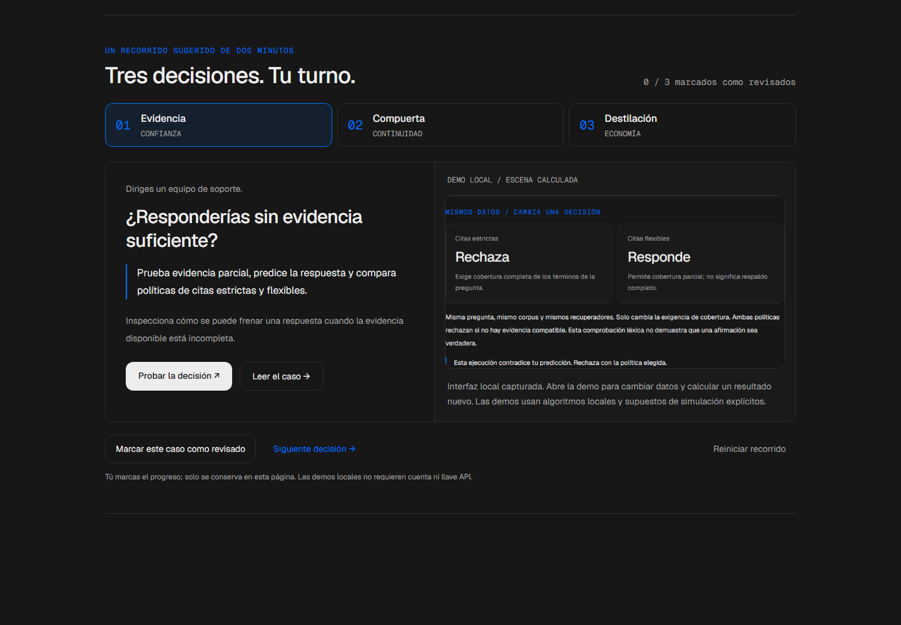
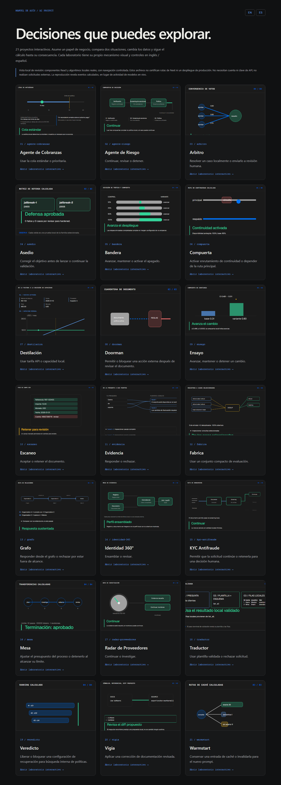

# Portafolio AI Product — Manuel de Asís

<!-- community-badges -->
[](https://github.com/mdeasis27/portafolio-mdea/actions/workflows/ci.yml) [](LICENSE)
<!-- /community-badges -->

[English](README.md) · [Portafolio](https://portafolio-mdea.vercel.app/es) · [Código](https://github.com/mdeasis27/portafolio-mdea)


21 prototipos interactivos conectan problemas de negocio con procesos de IA inspeccionables. Inglés es el idioma por defecto; español ofrece navegación y casos equivalentes. Cada proyecto distingue cálculo local, simulación determinista e integraciones opcionales. Los prototipos no afirman impacto en producción.

## Recorrido guiado (componente de QA)

La portada ahora destaca ocho proyectos directamente; este recorrido se conserva como componente de QA y ya no está en ella.

El recorrido para reclutadores se centra en **Evidencia** (confianza), **Compuerta** (continuidad) y **Destilación** (costo). Predice un resultado, cambia las condiciones e inspecciona comparaciones calculadas simultáneas. Cada demo explica decisiones de implementación, compromisos y el trabajo necesario antes de producción.

Abre la vista local del recorrido en `docs/quality/.component-labs/recruiter-journey/preview.html` después de ejecutar `python scripts/check-recruiter-missions.py`. Renderiza el componente real con navegación controlada, no la portada completa de Next. Los enlaces a demos locales están en su navegación de revisión. Los enlaces públicos apuntan a los despliegues existentes; esta etapa sigue sin publicar.



Consulta el [informe de verificación de esta etapa](docs/quality/recruiter-missions-acceptance.md).

### Piloto actual de misiones

El siguiente lote aprobado añade **Veredicto, Mesa y Doorman**. Consulta la [evidencia y límites de revisión del lote](docs/quality/mission-batch-acceptance.md). Genera sus vistas actuales con `node scripts/build-mission-previews.mjs veredicto mesa doorman recruiter-journey`. La aprobación visual previa de las seis misiones no certifica este lote nuevo.

Agente Riesgo, Ensayo y Warmstart incorporan comparaciones inspeccionables de políticas, estadística y caché. Las seis misiones sitúan los controles antes de la predicción opcional y permiten desplegar los detalles de la traza. Consulta la [evidencia actual y las comprobaciones pendientes](docs/quality/mission-pilot-acceptance.md). Las capturas existentes documentan la etapa anterior; las comprobaciones de navegador y capturas nuevas siguen pendientes. Genera los componentes locales actuales con `node scripts/build-mission-previews.mjs evidencia compuerta destilacion agente-riesgo ensayo warmstart recruiter-journey`.

## Probar localmente

Se requiere Node.js 22 y pnpm 10. No necesitas credenciales para navegar el hub ni ejecutar las demos principales.

```sh
pnpm install --frozen-lockfile
pnpm dev
pnpm build
pnpm lint
node --test scripts/portfolio-content.test.mjs design-system/demo/foundation.node-test.mjs
```

Abre `http://localhost:3000/en` o `/es`. Los enlaces públicos apuntan a despliegues existentes; el rediseño local no se publica automáticamente.

## Explorar los laboratorios de decisión

Cada proyecto tiene dos escenarios contrastantes, condiciones editables, una escena propia que sigue la traza y una consecuencia explicada. Los casos describen el papel de negocio, la decisión, el proceso y los límites del prototipo.

La galería local de revisión en `docs/quality/.component-labs/index.html` abre los 21 componentes React reales desde archivos, con navegación controlada. Se genera después de las pruebas de navegador con `node scripts/promote-decision-labs.mjs`. Es un recurso local de revisión, no un despliegue de producción.



## Arquitectura

- `src/app/[lang]/`: layout por idioma, inicio, catálogo, perfil y casos.
- `src/proxy.ts`: redirige rutas antiguas a inglés; conserva API y recursos.
- `content/projects/en/` y `es/`: MDX en pares con igual identidad técnica.
- `design-system/`: tokens y presentación de idiomas y demos.
- `ai-kit/`: integraciones opcionales en vivo; las demos principales no requieren claves.

Stack: Next.js 16.2.3, React 19.2.4, TypeScript estricto, Tailwind CSS 4 y MDX. Es un build de servidor Next, no una exportación estática. Cada proyecto tiene repositorio independiente.

## Evidencia y mantenimiento

Consulta [la evidencia de aceptación](docs/quality/decision-lab-acceptance.md). Añade casos en ambos idiomas y ejecuta la prueba de paridad. La propagación compartida rechaza repositorios con cambios; revisa archivos propios antes de `brand:sync` individual. No guardes secretos en archivos locales ni Git.

<!-- community-section -->
## Licencia y contribución

Publicado bajo la [licencia MIT](LICENSE). Se aceptan issues y pull requests: lee antes [CONTRIBUTING.md](CONTRIBUTING.md) y el [Código de Conducta](CODE_OF_CONDUCT.md). Para reportar una vulnerabilidad, consulta [SECURITY.md](SECURITY.md).
<!-- /community-section -->
