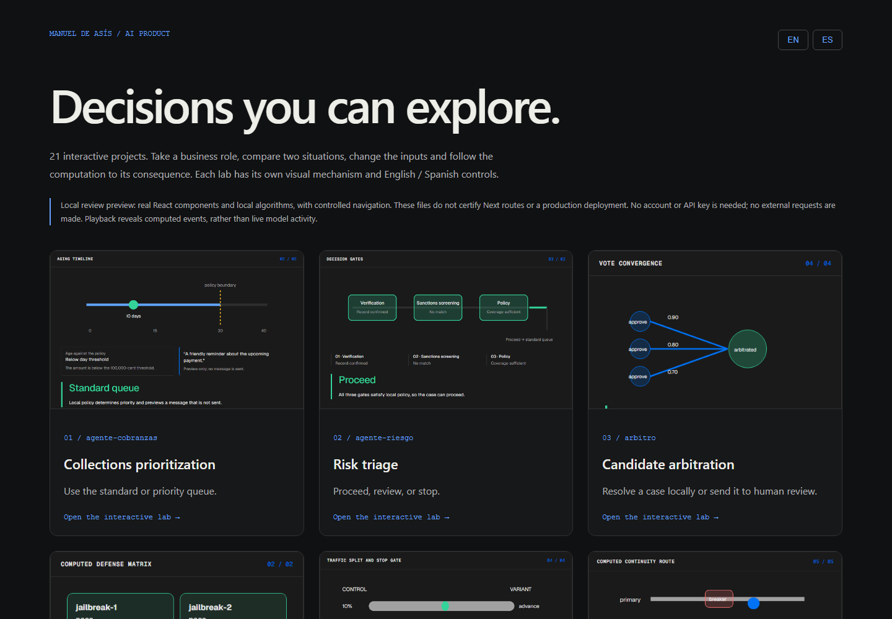
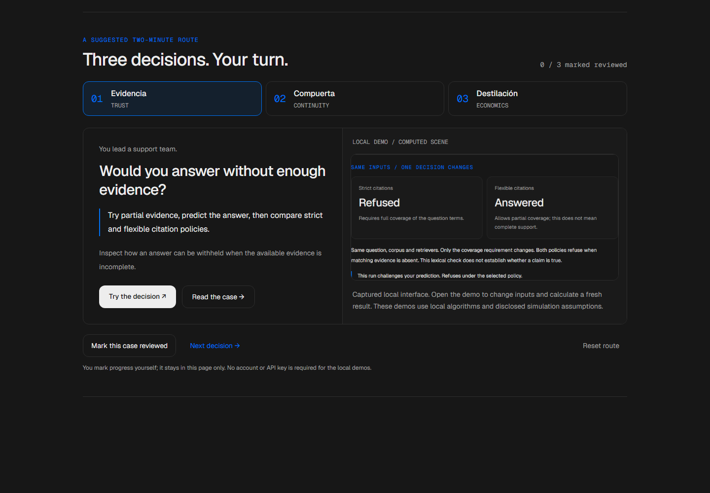
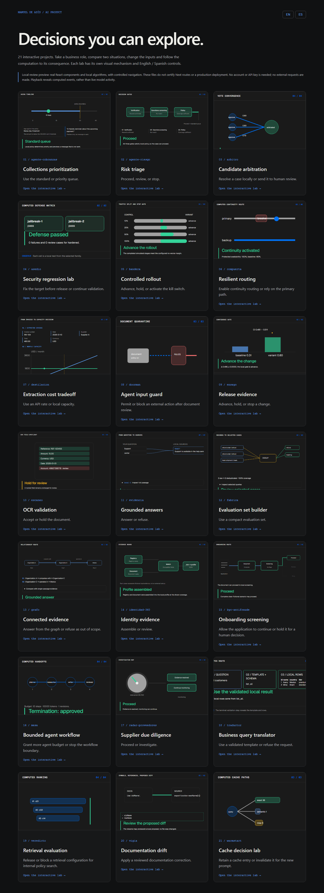

# AI Product Portfolio — Manuel de Asís

<!-- community-badges -->
[](https://github.com/mdeasis27/portafolio-mdea/actions/workflows/ci.yml) [](LICENSE)
<!-- /community-badges -->

[Español](README.es.md) · [Portfolio](https://portafolio-mdea.vercel.app/en) · [Source](https://github.com/mdeasis27/portafolio-mdea)



21 interactive prototypes connect business problems to inspectable AI workflows. English is the default; Spanish has equivalent navigation and case studies. Each project separates local computation, deterministic simulation and optional live integrations. These prototypes do not claim production impact.

## Guided route (QA component)

The homepage now features eight projects directly; this route is kept as a QA component and is no longer mounted there.

The guided recruiter route focuses on **Evidencia** (trust), **Compuerta** (continuity) and **Destilación** (cost). Predict a result, change the conditions and inspect simultaneous computed comparisons. Each demo explains implementation choices, tradeoffs and the work needed before production.

Open the generated local route preview at `docs/quality/.component-labs/recruiter-journey/preview.html` after running `python scripts/check-recruiter-missions.py`. It renders the real journey component with controlled navigation, not the complete Next homepage. The local demo links are in its review navigation. Public links still target the existing deployments; this phase remains unpublished.



See the [scoped verification report](docs/quality/recruiter-missions-acceptance.md).

### Current mission pilot

The next approved batch adds **Veredicto, Mesa and Doorman**. See [batch evidence and review limits](docs/quality/mission-batch-acceptance.md). Generate their current previews with `node scripts/build-mission-previews.mjs veredicto mesa doorman recruiter-journey`. Owner visual approval of the previous six missions does not certify this new batch.

Agente Riesgo, Ensayo and Warmstart now add inspectable policy, statistical and cache comparisons. The six missions place editable inputs before optional prediction and keep trace details collapsible. See [current pilot evidence and pending checks](docs/quality/mission-pilot-acceptance.md). Existing screenshots document the previous stage; fresh browser checks and captures remain pending. Generate the current local components with `node scripts/build-mission-previews.mjs evidencia compuerta destilacion agente-riesgo ensayo warmstart recruiter-journey`.

## Try it locally

Node.js 22 and pnpm 10 are required. No credentials are needed to browse the hub or run primary project demos.

```sh
pnpm install --frozen-lockfile
pnpm dev
pnpm build
pnpm lint
node --test scripts/portfolio-content.test.mjs design-system/demo/foundation.node-test.mjs
```

Open `http://localhost:3000/en` or `/es`. The live URLs above refer to existing deployments; local redesign changes are not published automatically.

## Explore the decision labs

Each project has two contrasting presets, editable conditions, a distinct trace-driven scene and an explained outcome. Case studies state the business role, decision, workflow and prototype limits.

A generated local review gallery at `docs/quality/.component-labs/index.html` opens all 21 real React components directly from files, with controlled navigation. Generate it after browser checks with `node scripts/promote-decision-labs.mjs`. It is a local diagnostic artifact, not a production deployment.



## Architecture

- `src/app/[lang]/`: locale root layout, home, catalogue, about and case studies.
- `src/proxy.ts`: legacy browser routes redirect to English; API/assets stay unchanged.
- `content/projects/en/` and `es/`: paired MDX with matching project identities.
- `design-system/`: portable tokens, locale and demo presentation.
- `ai-kit/`: optional live integration helpers; primary demos need no keys.

Stack: Next.js 16.2.3, React 19.2.4, strict TypeScript, Tailwind CSS 4, MDX. This is a Next server build, not a static export. Each sibling is an independent repository.

## Evidence and maintenance

See [acceptance evidence](docs/quality/decision-lab-acceptance.md). Add case studies in both locale directories and run the content parity check. Shared propagation rejects dirty repositories; review owned changes before individual `brand:sync`. Do not place secrets in local files or Git.

<!-- community-section -->
## License and contributing

Released under the [MIT License](LICENSE). Issues and pull requests are welcome: read [CONTRIBUTING.md](CONTRIBUTING.md) and the [Code of Conduct](CODE_OF_CONDUCT.md) first. To report a vulnerability, see [SECURITY.md](SECURITY.md).
<!-- /community-section -->
